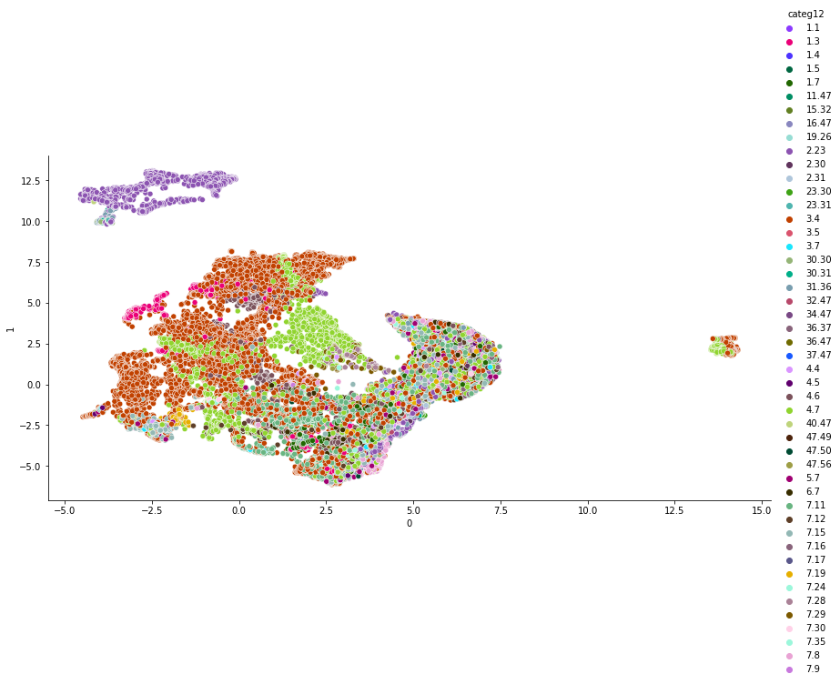

# RecSys Project 

For our project, we had a look at multiple recommender models.

* Word2Vec-based
* Gru4Rec
* TensorFlow Recommenders

***

## I. Word2Vec-based Model

The first model we had a look at were **Word2Vec-based models**. Since Word2Vec can 'understand' the meaning of words based on their context, and therefore predict which could be a missing word within a certain context: we though it would be a good try to make it **predict the 'missing' item of a session**. 

We made use of two main Python libraries: [Pandas](https://pandas.pydata.org/) and [Gensim](https://radimrehurek.com/gensim/models/word2vec.html). Gensim has a built-in function for training our own Word2Vec model, which we used for our project. We used the Word2Vec **CBOW (Continuous Bag of Words)** algortihm, as it focuses on predicting a missing word (in our case an item), based on a context of words (the items viewed during a single session).

**To run the script for this model**:

* either run the `run.sh` file in a terminal, 
* or directly run the python script `recsys_w2v.py` with `python recsys_w2v.py` (or using `python3`)

The script goes through the following steps:

1. **Loading** the data: the source folder is set to "~/shared/data/project/training/filename.csv"
2. **Processing** the data
3. **Training** the Word2Vec model: the trained model is uploaded under `word2vec_recsys.model`
4. **Creating** the `results_w2v.csv` file

We also uploaded the `recsys_w2v.ipynb` notebook file, which contains **more detailed explanations** and contains the **model testing parts** described below.

### Methodology

#### A. Data Processing
We had to perform **various preprocessing** steps before we can make use the dataset. The result we wanted to achieve were vectors of each session:

```python
session_1 = [100, 400, ... , 500]
```
This vector represents all items viewed and purchased within `session_1`.

The [Gensim](https://radimrehurek.com/gensim/models/word2vec.html) library takes a list of lists as input for training a Word2Vec model. Each element would be a list of words, or for our use case: **a list of items viewed or purchased in a session**. Therefore, we had to prepare our data so that we could use it as input for Gensim.

The final input data looked as following:

```python
[[100, 400, 500],  
  [50, 100],  
  [400, 100, 700, 400],  
  ... ]
```
  
... whereas **each list** represents a **separate session** and the `item_id`'s of the products have have been **viewed or purchased**.

#### B. Model Training

For our use case we chose to use the **Word2Vec CBOW (Continuous Bag of Words) algorithm**. This aims at predicition the missing "word" based on a given context - translated to our use case: it aims at **predicting the missing/next item** based on **other viewed items** in a session.

The CBOW algorithm is the default algortihm implemented in the Word2Vec function in the [Gensim](https://radimrehurek.com/gensim/models/word2vec.html) library.

We set the `window` (i. e. context) parameter to be equal to the **longest session** we observed, so that all items viewed in the session are considered for the prediction. We set `min_count` to 2 because we wanted to filter for items that have been **viewed at least twice**, or have been **purchased at least once**. The rest we left up to the default settings as described in the [Gensim](https://radimrehurek.com/gensim/models/word2vec.html) documentation.

#### C. Model Testing

We tested our model in various ways:

**C.1. Tested the predictions by item similarity**

With the use of the `item_features.csv` dataset, we **computed the similarity** between items based on their features. For this, we computed the **Jaccard similarity** between the one-hot encoded feature vectors for each item. Why Jaccard? Because we wanted items to only be considered similar based on common items, not uncommon items.

When we let our model predict the next purchase item for a certain session, we saw the following results:

```python
When viewing product ID: 13081 from Category: 4.7.24.28.29.33.47.50.53.55.56.61.62.63.68.69.72.73 

Our model recommends:
#ID: 13081 # Percent: 99.9838 ## Category: 4.7.24.28.29.33.47.50.53.55.56.61.62.63.68.69.72.73  # !TOP 5 % similar items
#ID: 19912 # Percent: 0.0118 ## Category: 4.7.24.28.29.33.47.50.53.55.56.61.62.63.68.69.72.73  # !TOP 5 % similar items
#ID: 24404 # Percent: 0.0021 ## Category: 4.7.24.28.29.30.30.33.47.50.53.55.56.61.62.63.68.69.72.73
#ID: 17362 # Percent: 0.0007 ## Category: 4.7.24.28.28.29.33.47.50.53.55.56.61.62.63.68.69.72.73  # !TOP 5 % similar items
#ID: 8981 # Percent: 0.0006 ## Category: 4.7.24.28.29.33.47.50.53.55.56.61.62.63.68.69.72.73  # !TOP 5 % similar items
#ID: 1780 # Percent: 0.0004 ## Category: 4.7.24.28.29.33.47.50.53.55.56.61.62.63.68.69.72.73  # !TOP 5 % similar items
#ID: 17979 # Percent: 0.0002 ## Category: 4.7.24.28.29.33.47.50.53.55.56.61.62.63.68.69.72.73  # !TOP 5 % similar items
#ID: 11746 # Percent: 0.0001 ## Category: 4.7.24.28.28.29.33.47.50.53.55.56.61.62.63.68.69.72.73  # !TOP 5 % similar items
#ID: 24482 # Percent: 0.0001 ## Category: 4.7.24.28.29.30.30.33.47.50.53.55.56.61.62.63.68.69.72.73
#ID: 20689 # Percent: 0.0001 ## Category: 4.7.24.28.29.33.47.50.53.55.56.61.62.63.68.69.72.73  # !TOP 5 % similar items
```
We can see, that out of 10 predictions, 8 predictions belonged to the *top 5% items most similar* to the viewed item. We can also observe that the categories the items belong to are very similar for the viewed and recommended items. We saw this happening various times, and though concluded that the model seemed to predict the items by similarities quite well.

**C.2. Visualized our model**

Additionnaly to the testing methog described in C.1., we also plotted our model, so we could **visualize the results** and get a good overview of what our model learned from our data. We uploaded image `plot_w2v.png`, where each data point represents **an item embedding** our model learned, coloured by **item cateories**. Since our initial embeddings were 100-dimensional, we had to first reduce their dimensions to 2 before being able to plot them. We coloured only by the first 2 categories, as this gave us a better view of the category clusters our model found.

<p align="center">
  
</p>


## II. Gru4Rec model

Our second solution is based on the https://github.com/paxcema/KerasGRU4Rec github repo, which is a Keras implementation of the original https://arxiv.org/abs/1511.06939 paper. This solution using GRUs (Gated recurrent units), which is something similar to LSTM networks, just with fewer parameters.

Unfortunately it took hours to train 1 epoch even on GPU, so we have not predicted the test results with the model, because we had problems during the training phase with Colab, it always disconnected. Finally we managed to get a model for 1 epoch, which is enough for the proof-of-concept, but it would require a lot more time and computational power to train the model during several epochs.

This solution uses only the session data, without the item features.

The code of the model is in the model/gru4rec.py file. In order to do the training you have to run the cells in the RecSys_GRU4Rec.ipynb notebook. There are the minor preprocessing steps in the notebook file as well.

To run the code for other purposes, like evaluation you can use these arguments at the end of RecSys_GRU4Rec notebook.
*    ('--resume', type=str, help='stored model path to continue training')
*    ('--train-path', type=str, default='../../processedData/rsc15_train_tr.txt')
*    ('--eval-only', type=bool, default=False)
*    ('--dev-path', type=str, default='../../processedData/rsc15_train_valid.txt')
*    ('--test-path', type=str, default='../../processedData/rsc15_test.txt')
*    ('--batch-size', type=str, default=16)
*    ('--eval-all-epochs', type=bool, default=True)
*    ('--save-weights', type=bool, default=True)
*    ('--epochs', type=int, default=10)

## III. TensorFlow Recommender 

The third approach is based on the TensorFlow Recommender's libary, which can be found here https://www.tensorflow.org/recommenders/examples/quickstart.

We implement a basic retrieval model, which takes sessions data, pads it with zeros until the maximum session length, further transforms it into an emdedded representation of 32 values and fits it to the GRU layer to catch the sequencial caracter of the data. This way we receive a query representation, which is matched by dot product with a candidate representation, consisting of 32 values as well.

In this basic scenario for the query model we take items in the session and for the candidate model we take the purchased items representation.

For the training purposes we split the data into train and test 90 to 10 percent. The training was done for 3 Epochs and the MRR for the test session is 0.01, which is low. The results could be improved with more computational resourses in the following way: adding information about timestamps and item features to the query model and to the candidate model at the same time. We can do it by normalizing timestamps and/or bucketing them. Item features can be also emdedded by considering "category_description" as one categorical feature, like this "85_75".

Further the information from both models can by separately concatenated and fed into a its own dense layers to receive an equally-sized representations for a query and a candidate model. Embedding dimentions can be also increases and regularisation added. 

In order to try the approach (build model and evaluate it) one can run model/TensorFlow_recommender.py
